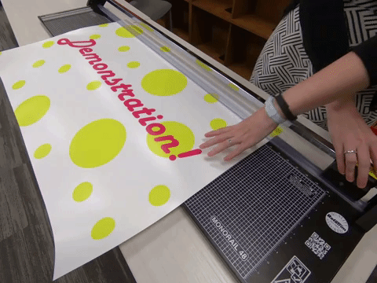

# Real-Time Object Detection with YOLOv8

Real-time object detection pipeline using a pre-trained YOLOv8 model with GPU-accelerated inference, tuned across multiple confidence thresholds for cleaner real-world detections.

## About this project
This project was built while working around limited local hardware (no dedicated GPU) — the development and testing workflow was optimized for that constraint, with full-speed inference validated separately via Google Colab's GPU runtime. It reflects a broader approach I bring to projects: work with what's available rather than wait for ideal conditions.

## Features
- Frame-by-frame video processing via the `ultralytics` package
- Annotated output with bounding boxes, class labels, and confidence scores
- Confidence threshold tuning to reduce false positives on street/scene footage

## Quick Start
\`\`\`bash
git clone https://github.com/a-gun8591/yolov8-object-detection.git
cd yolov8-object-detection
pip install -r requirements.txt
python detect.py --source input_video.mp4 --conf 0.4
\`\`\`

## Results
| Confidence Threshold | Observation |
|---|---|
| 0.25 | More detections, higher false-positive rate |
| 0.4| Balanced precision/recall |
| 0.7  | Fewer false positives, may miss smaller/occluded objects |

## Tech Stack
Python · YOLOv8 (Ultralytics) · OpenCV · Google Colab
